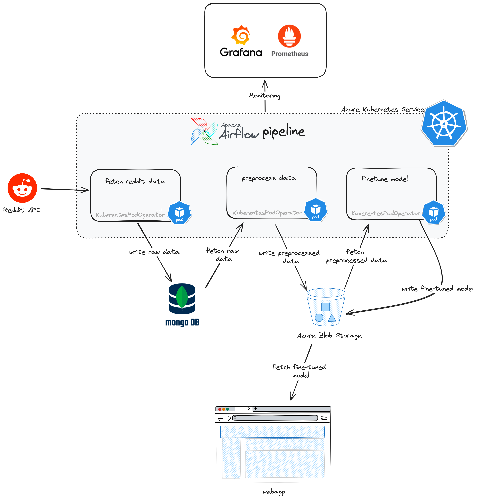

# Finetuning Domain-specific LLM Pipeline

## Overview

This project is a data science pipeline designed to fetch data from Reddit on any topic, store it in MongoDB, preprocess the data into a question-answer format, and fine-tune a Hugging Face Language Model (LLM). The entire workflow is orchestrated using Apache Airflow and deployed on Kubernetes.



## Features

* **Decoupled Development and Deployment**: Data science team can exclusively focus on crafting and refining training scripts without worrying about deployment or infrastructure complexities.
* **Platform Agnosticism**: Currently using Azure Blob Storage and Container Registry, but the code is designed to be platform-agnostic. The mddleware layer can be extended to integrate with different platforms without touching the core business logic.
* **Advanced Workflow Management and Auto-scaling**: Orchestrated the pipeline using Apache Airflow. Using KuberentesPodOperator to run DAG tasks and deployed to Kubernetes for dynamic auto-scaling.
* **Monitoring and Observability**: Using prometheus and Grafana for infrastructure monitoring and observability.

## Set-up

### Local setup

1. Create a virtual env

   ```sh
   python3 -m venv .venv
   source .venv/bin/activate
   ```

2. Create a copy of .env.example and rename to .env
    * For local developement, change the `BLOB_TYPE=local` and `BLOB_BASE_DIR=$PROJECT_ROOT/blob`

### Deployment

1. Setup kubernetes cluster
2. Setup container registery
3. Create namespace on k8s

   ```sh
   kubectl create namespace <K8S_NAMESPACE>
   ```

4. Create container registery secret key on your deployment. This will allow you to pull images from private conteiner

   ```sh
   kubectl create secret docker-registry <SECRET_NAME> \ 
   --namespace=<K8S_NAMESPACE> \
   --docker-server=<DOCKER_SERVER> \
   --docker-username=<USERNAME> \
   --docker-password=<PASSWORD>
   ```

5. Use this secret name in airflow's KubernetesPodOperator function and also in helm values.yaml

### Developement Workflow

1. If you're changing the training code, you need to rebuild the image and push it to the container registery

   ```sh
   docker build . -t train_pipeline -f trainer/Dockerfile
   docker tag docker.io/library/train_pipeline  <CONTAINER_REGISTERY>/train_pipeline
   docker push <CONTAINER_REGISTERY>/train_pipeline
   ```

    * Now you can head over to the airflow UI and re-running the pipeline will now use your new image
2. If you're changing the airflow pipeline itself

   ```sh
   docker build . -t customllm_airflow -f trainer/Dockerfile.airflow
   docker tag docker.io/library/customllm_airflow  <CONTAINER_REGISTERY>/customllm_airflow
   docker push <CONTAINER_REGISTERY>/customllm_airflow
   ```

   And now re-deploy the helm charts

   ```sh
   helm upgrade --recreate-pods  --install airflow . --create-namespace  --namespace <K8S_NAMESPACE> --values values.yaml
   ```

### Web-App

* The `webapp/` contains a simple flask app that hosts a chat-bot stype web page to run the model.
